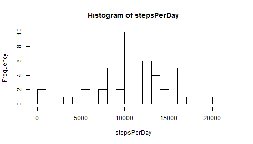
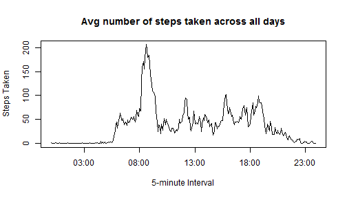
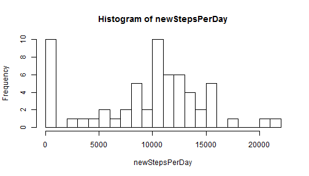
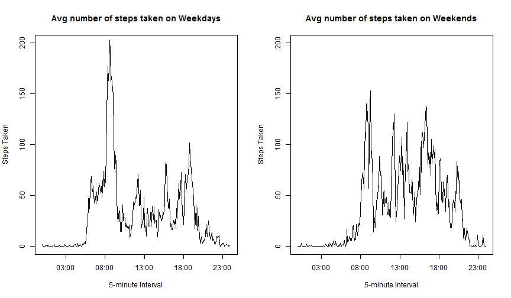

The following is a set of steps taken to complete the requirements for Project 1 of the Reproducible Research course on Coursera.

##Step 1: Loading and preprocessing the data

Show any code that is needed to  
1. Load the data (i.e. read.csv())  
2. Process/transform the data (if necessary) into a format suitable for your analysis

```r
#Checks if "activity.zip"" is in R working directory, downloads if it doesn't exist
if (!file.exists("activity.zip")) {
    download.file("https://d396qusza40orc.cloudfront.net/repdata%2Fdata%2Factivity.zip","activity.zip")
}
file<-read.csv(file=unz("activity.zip","activity.csv"))

#This step requires the user to have installed the 'data.table' package
library(data.table)
table<-data.table(file)
```
##Step 2: What is mean total number of steps taken per day?

For this part of the assignment, you can ignore the missing values in the dataset.  
1. Calculate the total number of steps taken per day  
2. Make a histogram of the total number of steps taken each day  
3. Calculate and report the mean and median of the total number of steps taken per day

```r
#Calculate the total number of steps per day
stepsPerDay<-tapply(table$steps,table$date,sum)

#Plot a histogram of the number of steps per day
hist(stepsPerDay,breaks=20)
```

 

```r
#Calculate the mean and median number of steps per day
stepsMean<-mean(stepsPerDay,na.rm=TRUE)
stepsMedian<-median(stepsPerDay,na.rm=TRUE)
```
In this data set, the mean steps per day is 10766.19 and the median steps per day is 10765.

##Step 3: What is the average daily activity pattern?

1. Make a time series plot (i.e. type = "l") of the 5-minute interval (x-axis) and the average number of steps taken, averaged across all days (y-axis)  
2. Which 5-minute interval, on average across all the days in the dataset, contains the maximum number of steps?

```r
#Calculate the mean number of steps at each 5-minute time interval across all days
intervalMean <- tapply(table$steps,table$interval,mean,na.rm=TRUE)

#Plot the mean number of steps at each 5-minute time interval across all days
#plot(unique(table$interval),intervalMean,"l",xlab="5-minute Interval",ylab="Steps Taken",main="Avg number of steps taken across all days")
plot(strptime(sprintf("%04d", unique(table$interval)), format="%H%M"),intervalMean,"l",xlab="5-minute Interval",ylab="Steps Taken",main="Avg number of steps taken across all days")
```

 

```r
#Calculate the maximum number of average steps across all days and what 5-minute time interval it corresponds to
maxAvgSteps <- max(intervalMean)
maxInterval <- names(intervalMean[intervalMean == maxAvgSteps])
```
The maximum number of average steps taken across all days is 206.17 and the corresponding 5-minute interval is 835.

##Step 4: Imputing missing values

Note that there are a number of days/intervals where there are missing values (coded as NA). The presence of missing days may introduce bias into some calculations or summaries of the data.  

1. Calculate and report the total number of missing values in the dataset (i.e. the total number of rows with NAs)  
2. Devise a strategy for filling in all of the missing values in the dataset. The strategy does not need to be sophisticated. For example, you could use the mean/median for that day, or the mean for that 5-minute interval, etc.  
3. Create a new dataset that is equal to the original dataset but with the missing data filled in.  
4. Make a histogram of the total number of steps taken each day and Calculate and report the mean and median total number of steps taken per day. Do these values differ from the estimates from the first part of the assignment? What is the impact of imputing missing data on the estimates of the total daily number of steps?

```r
#Count the number of rows with missing data
missingDataRows<-sum(!complete.cases(table))

#Fill in missing values by zeroing out NAs and adding the mean over all days for that 5-minute interval
table2 <- table
table2[is.na(table2)]<-0
table2$steps<-table2$steps + is.na(table2$steps)*rep(intervalMean,length(levels(table$date)))
newStepsPerDay<-tapply(table2$steps,table2$date,sum)

#Plot a histogram of the new number of steps per day
hist(newStepsPerDay,breaks=20)
```

 

```r
#Calculate the Mean and Median number of steps per day with the filled-in data
newStepsMean<-mean(newStepsPerDay)
newStepsMedian<-median(newStepsPerDay)
```
In the original data set, there were 2304 rows that had missing values.  

In the new imputed data set, the new mean steps per day is 9354.23 and the new median steps per day is 10395. As evidenced by the above histogram, imputing missing values by replacing them with their interval mean over all days leads to a lower mean and median as it introduces more data points with very small values.

##Step 5: Are there differences in activity patterns between weekdays and weekends?

For this part the weekdays() function may be of some help here. Use the dataset with the filled-in missing values for this part.  

1. Create a new factor variable in the dataset with two levels - "weekday" and "weekend" indicating whether a given date is a weekday or weekend day.  
2. Make a panel plot containing a time series plot (i.e. type = "l") of the 5-minute interval (x-axis) and the average number of steps taken, averaged across all weekday days or weekend days (y-axis). See the README file in the GitHub repository to see an example of what this plot should look like using simulated data.

```r
#Identify which days are weekdays and weekend
dayOfWeek<-weekdays(as.Date(table2$date))
weekdayOrWeekend<-rep("Weekday",length(table2$date))
weekdayOrWeekend[dayOfWeek == "Saturday"]<-"Weekend"
weekdayOrWeekend[dayOfWeek == "Sunday"]<-"Weekend"

#Append the table with the filled-in missing values with a Weekday/Weekend factor 
table2[,"Weekday_Weekend"]<-as.factor(weekdayOrWeekend)

#Calculate the mean and median number of steps per day, split between Weekdays and Weekends
stepsMean_WeekdayWeekend <- tapply(table2$steps,list(table2$interval,table2$Weekday_Weekend),mean)

#Plot the average number of steps over each interval for both weekdays and weekends
par(mfrow=c(1,2))
plot(strptime(sprintf("%04d", unique(table2$interval)), format="%H%M"),stepsMean_WeekdayWeekend[,1],"l",ylim=range(0:200),xlab="5-minute Interval",ylab="Steps Taken",main="Avg number of steps taken on Weekdays")
plot(strptime(sprintf("%04d", unique(table2$interval)), format="%H%M"),stepsMean_WeekdayWeekend[,2],"l",ylim=range(0:200),xlab="5-minute Interval",ylab="Steps Taken",main="Avg number of steps taken on Weekends")
```

 
